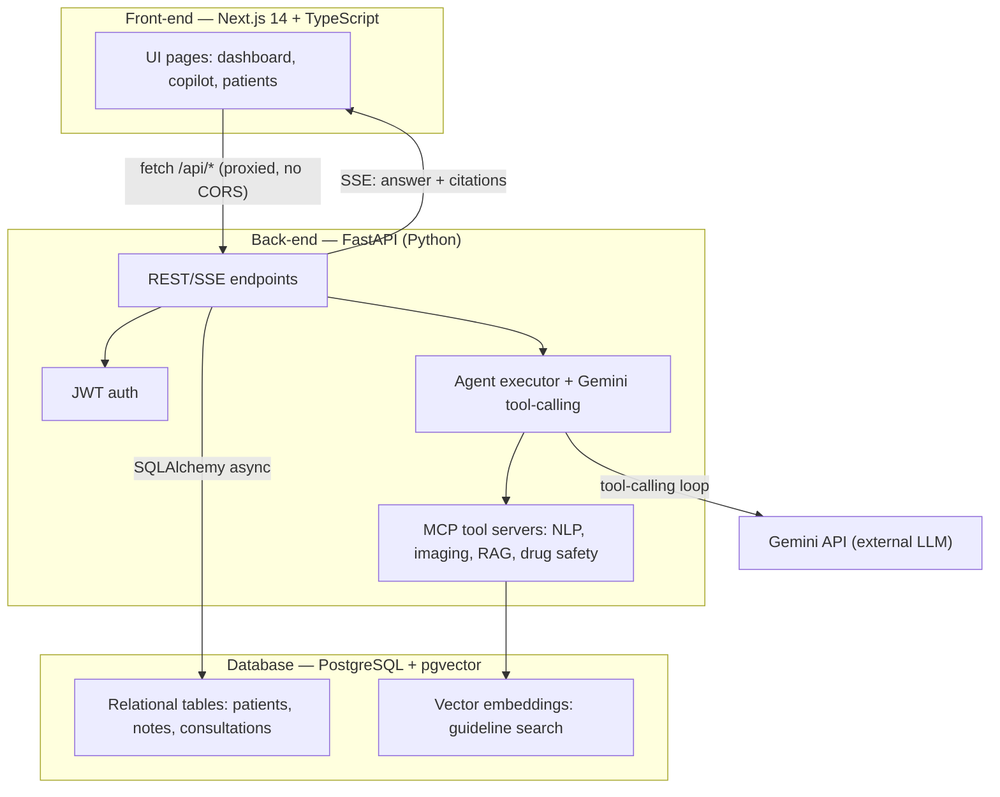

# SEPHIROTH — Stack & Justification

Quick overview of the tech choices for this project. Detailed module architecture: [ARCHITECTURE.md](ARCHITECTURE.md). Full numbered design decisions: `CLAUDE.md`.

## Front-end

- **Framework:** Next.js 14 (App Router)
- **Language:** TypeScript
- **Extra tools:** Tailwind CSS (styling + design tokens), Radix (accessible UI components), React Query (server-state fetching/caching), Recharts (dashboard charts)
- **Location:** `platform/frontend/`

## Back-end

- **Language:** Python 3.11
- **Framework:** FastAPI (async), served with Uvicorn
- **Auth:** JWT (bcrypt + pyjwt), two roles (`clinician`, `patient`)
- **AI agent orchestration:** custom async executor (`src/sephiroth/runtime/`)
- **LLM:** Google Gemini API (`gemini-flash-latest`), free AI Studio tier; optional Groq fallback
- **Location:** `platform/api/`, `platform/auth/`, `platform/core/`, `src/sephiroth/`

## Database

- **Engine:** PostgreSQL 15
- **Type:** Relational, with the `pgvector` extension for embeddings (hybrid vector search in the RAG pipeline)
- **ORM/migrations:** SQLAlchemy 2.0 + Alembic
- **Local deployment:** `pgvector/pgvector:pg15` Docker container (host port 5433)
- **Cloud option:** Supabase Postgres (native pgvector support), using the session pooler (port 5432 — not the 6543 transaction pooler, since asyncpg needs prepared statements)

## Why these choices

- **Next.js + TypeScript:** static typing cuts down errors in a clinical dashboard with multiple roles and views (clinician/patient); App Router + React Query make async data (timelines, lab results, images) easier to manage.
- **FastAPI:** native async is needed because each consultation fires several AI agents in parallel (Gemini calls + MCP tools); Pydantic typing gives automatic request/response validation.
- **PostgreSQL + pgvector:** clinical data (patients, notes, consultations, appointments) needs a relational database with strong referential integrity, but the evidence RAG (clinical guidelines, PubMed) needs semantic search. pgvector gives both in one engine instead of running a separate relational DB and vector DB.
- **Gemini API (no local LLM):** the only free tier covering multi-round tool-calling, structured JSON output, and multimodal vision in one provider — no GPU or local model server needed.

## How the pieces talk to each other

The frontend never talks to Postgres or Gemini directly — everything goes through the FastAPI backend, which centralizes auth (JWT), agent orchestration, and data access.
