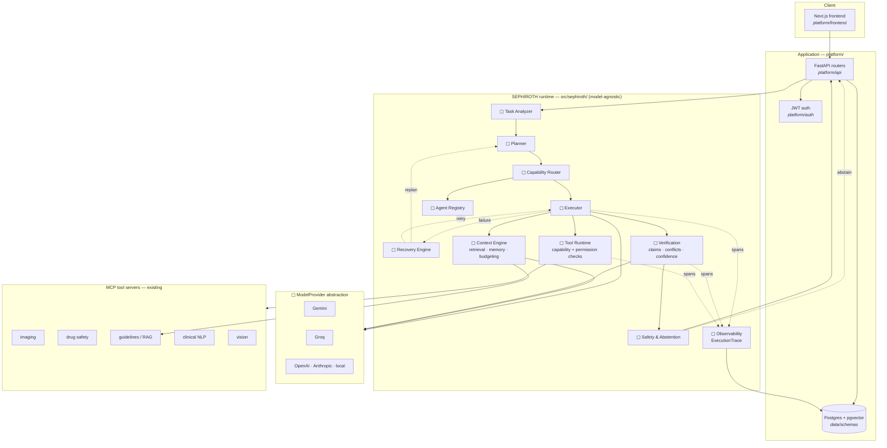

# D1 — High-Level Architecture

> **Status: target.** This is the architecture Phases 0–5 build toward, not
> what runs today. Boxes marked ▢ do not exist yet; see
> [project-state.yaml](../../project-state.yaml) for what is actually
> implemented, and [the migration charter](../../00-migration-charter.md) for
> the phase order.

The organising idea: **the runtime is the product, the clinical application is
its first consumer.** Everything inside the runtime box is domain-agnostic; the
clinical specifics live in the agents and tools it is configured with.

## What this changes

| | Today | Target |
|---|---|---|
| Routing | static key-presence check | capability match against a registry |
| Orchestration | fixed compiled graph, depth 2 | plan-driven executor, replanning possible |
| Provider | `GeminiClient` imported by name | `ModelProvider` selected by config |
| Tool access | whitelist filters advertised schemas | capability + permission checked at dispatch |
| Verification | citation labels audited post-hoc | claims verified against evidence, in-loop |
| Failure | exception propagates | classified, then retried / replanned / abstained |
| Observability | ad-hoc log lines | structured, nested, replayable trace |

## Reading the arrows

Solid arrows are the request path. Dotted arrows are exceptional or ambient:
failure handling, and span emission. The Recovery Engine is deliberately drawn
feeding *back* into the planner — replanning after failure is the capability
that distinguishes a runtime from a pipeline.
